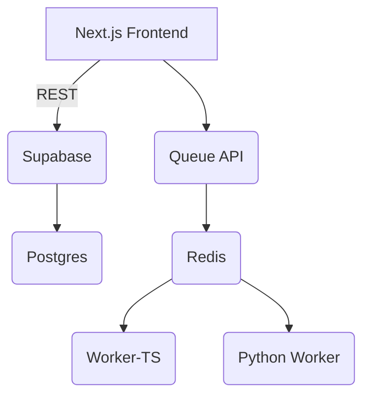

### 1. Executive Summary

**Primary Value Propositions**
- Unified Postgres-based data store replaces Airtable limitations
- Real-time capabilities via Supabase subscriptions (no polling)
- Lower infra cost by removing Make.com & Airtable fees
- Python automation workers enable unlimited custom jobs
- Simplified DevOps: single Docker-compose stack for local & prod

**Strategic Alignment**
Migrating to Supabase aligns with the company’s initiative to consolidate data, reduce SaaS spend, and support rapid feature delivery on a modern full-stack platform.

**Core Benefits**
- Central source of truth (row-level security, transactional integrity)
- Faster backend queries compared to Airtable REST API
- Seamless scaling on Supabase Cloud
- Background job framework (Redis + BullMQ + Python) for AI and scraping tasks

**Success Definition**
Project considered successful when the production TalentGuard app runs exclusively on Supabase, all data & automations function as before (or better), and monthly SaaS spend drops ≥ 30 %.

---

### 2. Scope Definition

**In Scope**
1. Design & create 7 Supabase tables + enums (completed)
2. One-off migration scripts to import historical Airtable data
3. Replace Airtable client code with Supabase client across API routes & hooks
4. Implement Python worker service listening to Redis queues
5. Docker-compose dev stack (Next.js, worker-service, python-service, redis)
6. CI/CD pipeline updates (GitHub Actions + Supabase migrations)
7. Documentation & developer onboarding updates

**Out of Scope**
1. Net-new product features not related to migration
2. Salesforce JSforce refactor (handled in later phase)
3. Mobile app changes
4. Advanced analytics dashboards (future)

**Future Considerations**
- GraphQL API exposure via PostgREST
- Supabase Edge Functions for heavy AI inference
- Multi-tenant org model & RLS per-customer

---

### 3. Target Market & User Analysis

#### 3.1 Ideal Customer Profile (ICP)
- Company size: 200–1 000 employees
- Industry: B2B SaaS / HR Tech
- Tech stack: modern JS front-end, Postgres backend, using AI workflows
- Business context: replacing spreadsheets & Airtable with scalable DB
- Success criteria: faster prospect research, reduced manual effort

#### 3.2 User Personas
1. **Sales Ops Analyst**
   - Demographic: Mid-level, GTM ops team
   - Goals: Accurate buyer data, automated signals
   - Pain: Airtable API rate limits, manual CSV exports
   - Proficiency: Intermediate tech skills
   - Usage: Daily dashboard checks
   - Decision influence: Medium
2. **Full-Stack Engineer**
   - Goals: Simple local dev, fewer 3rd-party services
   - Pain: Multiple SaaS credentials, brittle Airtable formulas
   - Proficiency: High
   - Usage: Maintains codebase
   - Decision influence: High

---

### 4. User Stories & Acceptance Criteria

#### 4.1 Core User Stories
- *As a Sales Ops Analyst, I want company & contact data to load instantly so that I can prioritize outreach faster.*
- *As an Engineer, I want a one-command local stack so that onboarding a new dev takes <10 minutes.*

#### 4.2 Detailed User Flows
Primary workflow: fetch dashboard → Supabase query → display table; enqueue “Generate PDF” → Redis → Python worker → Supabase storage → UI reflects status.

Acceptance criteria: p95 API < 300 ms, job completes < 5 min, zero Airtable requests.

---

### 5. Feature Specifications

#### 5.1 Feature Hierarchy
| Feature | Priority | Complexity | Value |
| --- | --- | --- | --- |
| Supabase DB | Critical | Moderate | High |
| Data Migration Script | High | Moderate | High |
| Supabase Client Refactor | Critical | Complex | High |
| Python Automation Service | High | Complex | High |
| Docker-compose Dev Env | Medium | Simple | Medium |

#### 5.2 Detailed Requirements
- Functional: CRUD via Supabase; queue endpoint `/api/queue/:task`
- UI: no change besides faster load & status badges
- Data: UUID PKs, FKs as per schema
- Technical: Node 18, Supabase JS v2, BullMQ 5, Redis 7
- Business rules: only authenticated users can write; RLS `role = 'staff'`
- Performance: <400 ms server action round-trip

---

### 6. Technical Architecture & Implementation

#### 6.1 Technology Stack
- Frontend: Next.js 14 + React 18
- Backend: Supabase Hosted Postgres + Edge Functions
- Queue: Redis + BullMQ (TS) + Python workers
- Authentication: Supabase Auth (email magic link)
- Hosting: Vercel (web) + fly.io (workers) + Supabase Cloud (DB)
- Tools: ESLint, Prettier, Playwright, GitHub Actions

#### 6.2 Directory Structure
```shell
project/
├── supabase/ (migrations)
├── worker-service/ (TS BullMQ workers)
├── python-service/
├── src/
│   ├── app/
│   ├── lib/
│   ├── components/
│   └── hooks/
└── docker-compose.yml
```

#### 6.3 Database Schema Design
*(Already implemented; see migration 006)*

#### 6.4 API Design & Endpoints
- `POST /api/queue/{task}` – enqueue job
- `GET /api/status/{id}` – job progress

#### 6.5 System Architecture Diagram


---

### 7. Detailed Task Breakdown & Planning

*(Sample tasks only)*
| ID | Title | Description | Assignee | Dep | Priority | Effort | Status |
| --- | --- | --- | --- | --- | --- | --- | --- |
| T-01 | Export Airtable schema | Use metadata API & save JSON | FE Dev | — | High | S | Done |
| T-02 | Write Supabase migration | Create tables & enums | BE Dev | T-01 | High | M | Done |
| T-03 | Data import script | Node script to insert CSV | BE Dev | T-02 | High | M | Todo |

---

### 8. KPIs & Success Metrics
- Activation Rate ≥ 70 % of users loading Supabase-powered dashboard
- API p95 latency < 300 ms
- SaaS cost reduction ≥ 30 %

---

### 9. Testing & Quality Assurance
- Unit: Jest for utils
- Integration: Supabase Test containers
- E2E: Playwright against dev DB

---

### 10. Deployment & Rollout Plan
- Phase 1: dev parity
- Phase 2: migrate data, toggle feature flag to Supabase in staging
- Phase 3: cutover production after 24 h monitoring

---

### 11. Risks & Mitigation
| Risk | L | I | Mitigation |
| --- | --- | --- | --- |
| Data import failure | M | H | Dry-run on staging, backup CSV |
| RLS mis-config | L | H | Automated tests for auth roles |

---

### 12. Open Questions
| ID | Question | Owner | Due | Status |
| Q1 | Will Salesforce data stay in Airtable? | PM | TBD | Open |

---

### 13. Stakeholder Sign-Off
| Name | Role | Signature | Date |
| --- | --- | --- | --- |
|  | Product Manager |  |  |
|  | Engineering Lead |  |  |

---

### 14. Appendix / References
- `docs/airtable-schema.md`
- Supabase migration 006
- Docker compose example 